# Performance Testing for DB-Poultry CRUD Functions

## Flock

### Create Flock

#### Test 1
Total Samples:      500  
Minimum Time:       91,800 ns  
Maximum Time:       34,290,800 ns  
Mean Time:          668,543.20 ns  
Median Time:        469,350.00 ns  
Std Dev:            2,142,554.38 ns  
95th Percentile:    1,078,835.00 ns

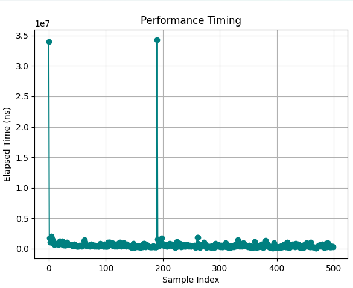

#### Test 2
Total Samples:      500  
Minimum Time:       79,300 ns  
Maximum Time:       23,219,700 ns  
Mean Time:          524,921.40 ns  
Median Time:        412,600.00 ns  
Std Dev:            1,054,143.86 ns  
95th Percentile:    972,165.00 ns

#### Test 3
Total Samples:      10000  
Minimum Time:       38,500 ns  
Maximum Time:       20,550,100 ns  
Mean Time:          242,579.14 ns  
Median Time:        186,700.00 ns  
Std Dev:            288,943.55 ns  
95th Percentile:    588,005.00 ns

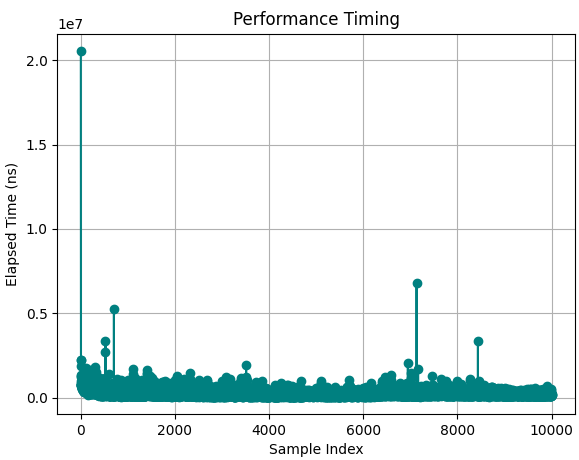

### Read Flock given Date

#### Test 1
Total Samples:      500
Minimum Time:       42,500 ns
Maximum Time:       14,785,400 ns
Mean Time:          146,655.00 ns
Median Time:        96,000.00 ns
Std Dev:            661,484.77 ns
95th Percentile:    277,660.00 ns

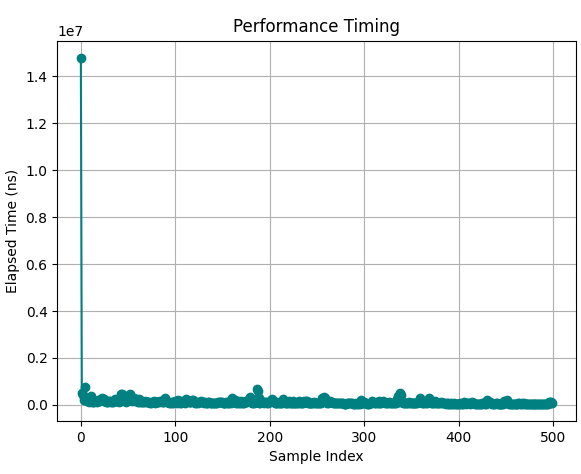

#### Test 2
Total Samples:      500  
Minimum Time:       43,700 ns  
Maximum Time:       12,804,200 ns  
Mean Time:          160,469.00 ns  
Median Time:        105,700.00 ns  
Std Dev:            576,585.28 ns  
95th Percentile:    315,750.00 ns

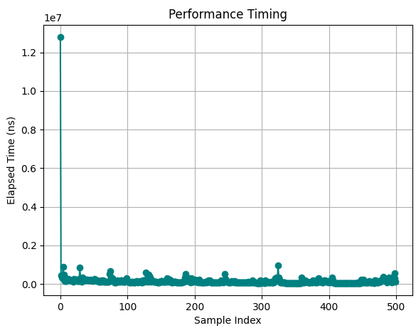

#### Test 3
Total Samples:      10000  
Minimum Time:       19,700 ns  
Maximum Time:       11,836,000 ns  
Mean Time:          54,146.81 ns  
Median Time:        39,100.00 ns  
Std Dev:            134,665.75 ns  
95th Percentile:    137,105.00 ns

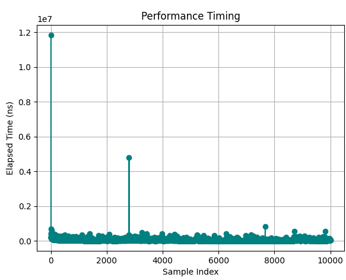

### Read All Flocks given Date Range

#### Test 1
Total Samples:      500  
Minimum Time:       54,700 ns  
Maximum Time:       15,949,500 ns  
Mean Time:          174,648.40 ns  
Median Time:        104,250.00 ns  
Std Dev:            715,208.81 ns  
95th Percentile:    363,925.00 ns

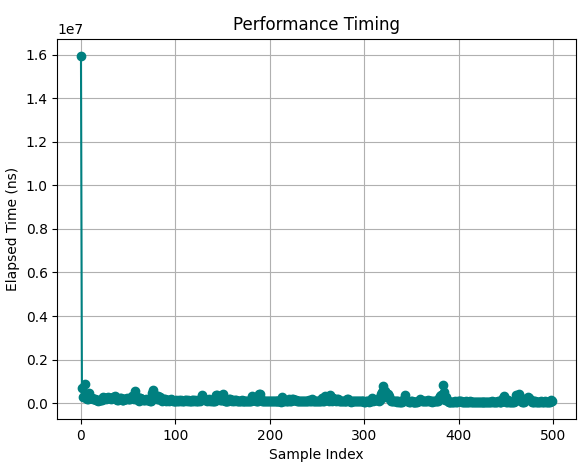

#### Test 2
Total Samples:      500  
Minimum Time:       49,700 ns  
Maximum Time:       15,013,600 ns  
Mean Time:          158,198.00 ns  
Median Time:        100,350.00 ns  
Std Dev:            671,554.77 ns  
95th Percentile:    304,410.00 ns

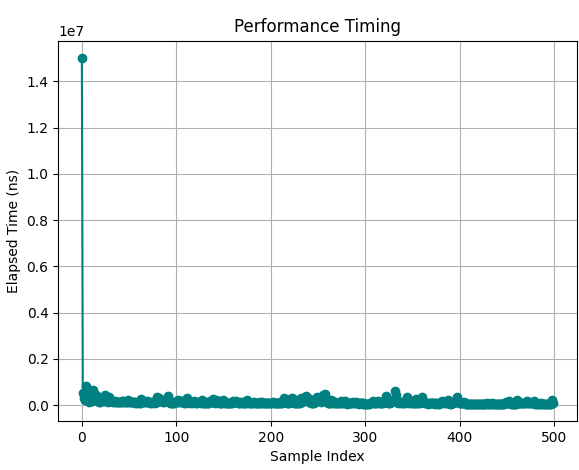

#### Test 3
Total Samples:      10000  
Minimum Time:       20,300 ns  
Maximum Time:       17,132,600 ns  
Mean Time:          73,941.13 ns  
Median Time:        43,500.00 ns  
Std Dev:            190,911.07 ns  
95th Percentile:    213,400.00 ns

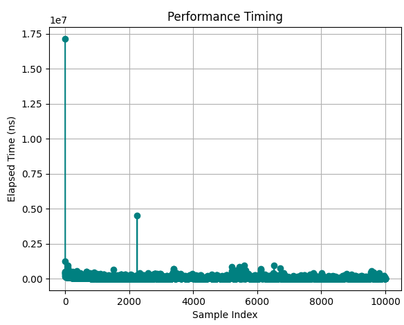

## Supply Type

### Create Supply Type

> For supply types, we simulate incorrect insertions (some validation steps fail)
> For Test 1 and 2 the actual total samples are 500 but the total samples in the 
> statistics are the successful insertions.

#### Test 1
Total Samples:      166  
Minimum Time:       18,100 ns  
Maximum Time:       13,473,300 ns  
Mean Time:          478,609.04 ns  
Median Time:        246,800.00 ns  
Std Dev:            1,128,199.50 ns  
95th Percentile:    1,127,950.00 ns

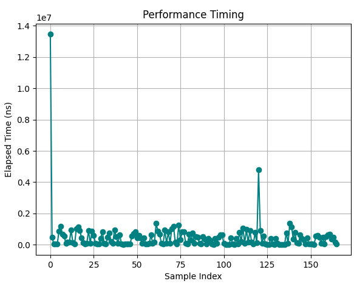

#### Test 2

Total Samples:      161  
Minimum Time:       21,300 ns  
Maximum Time:       11,357,100 ns  
Mean Time:          443,903.73 ns  
Median Time:        363,300.00 ns  
Std Dev:            974,854.80 ns  
95th Percentile:    911,500.00 ns

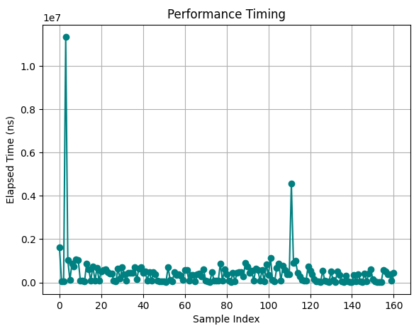

#### Test 3

Total Samples:      182  
Minimum Time:       18,200 ns  
Maximum Time:       11,043,600 ns  
Mean Time:          314,186.81 ns  
Median Time:        200,600.00 ns  
Std Dev:            836,685.21 ns  
95th Percentile:    809,305.00 ns

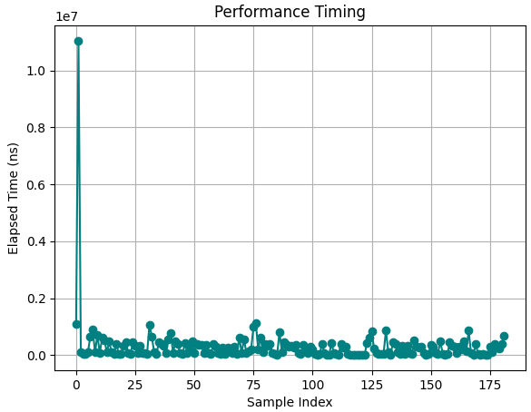

### Read Supply Types

#### Test 1

Read All Supply Types   3037200ns
Read All Supply Types   380500ns

#### Test 2

Read All Supply Types   2400500ns
Read All Supply Types   274400ns

#### Test 3

Read All Supply Types   2311500ns
Read All Supply Types   1322400ns

