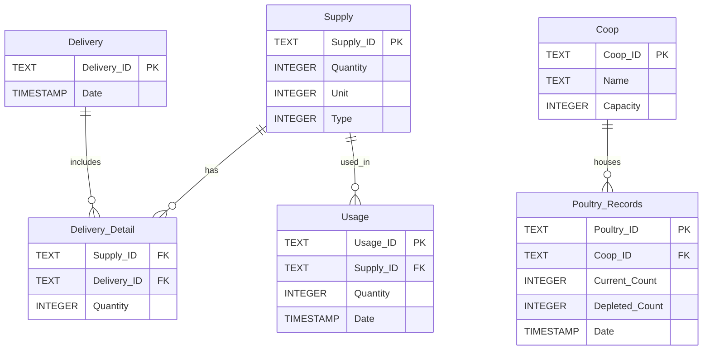

# Entity Relationship Diagram for DB-Poultry DBMS

```mermaid
erDiagram
    Supply {
        TEXT Supply_ID PK
        INTEGER Quantity
        INTEGER Unit
        INTEGER Type
    }
    Delivery {
        TEXT Delivery_ID PK
        TIMESTAMP Date
    }
    Delivery_Detail {
        TEXT Supply_ID FK
        TEXT Delivery_ID FK
        INTEGER Quantity
    }
    Usage {
        TEXT Usage_ID PK
        TEXT Supply_ID FK
        INTEGER Quantity
        TIMESTAMP Date
    }
    Coop {
        TEXT Coop_ID PK
        TEXT Name
        INTEGER Capacity
    }
    Poultry_Records {
        TEXT Poultry_ID PK
        TEXT Coop_ID FK
        INTEGER Current_Count
        INTEGER Depleted_Count
        TIMESTAMP Date
    }

    Supply ||--o{ Delivery_Detail : has
    Delivery ||--o{ Delivery_Detail : includes
    Supply ||--o{ Usage : used_in
    Coop ||--o{ Poultry_Records : houses
```